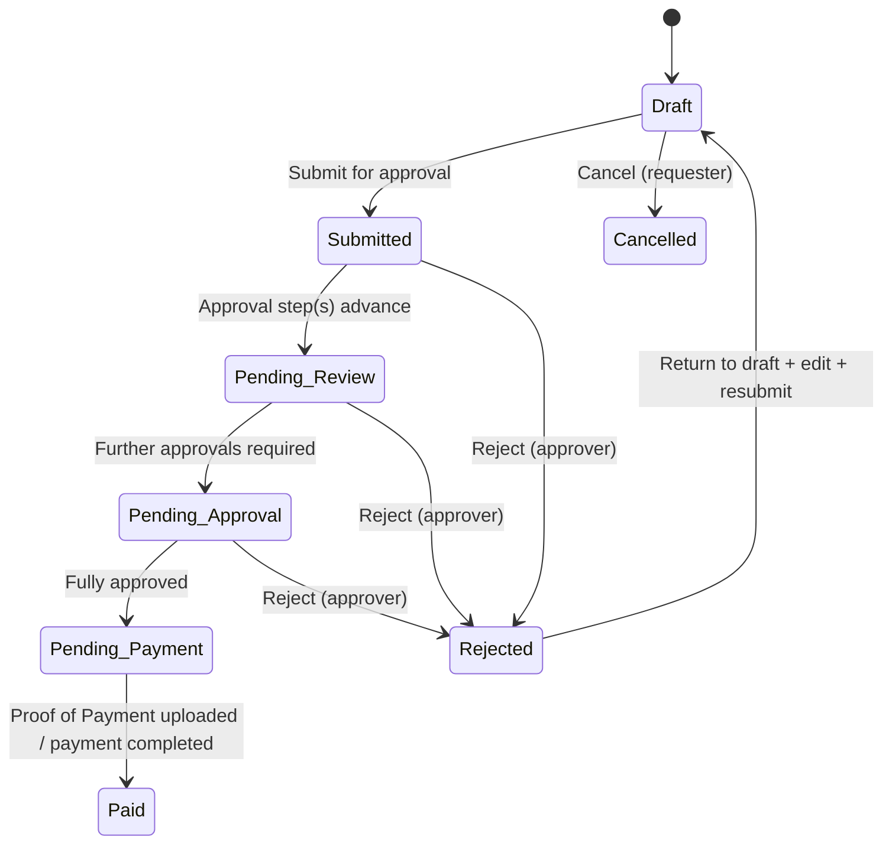
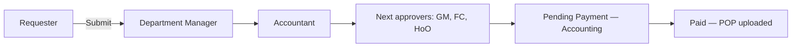
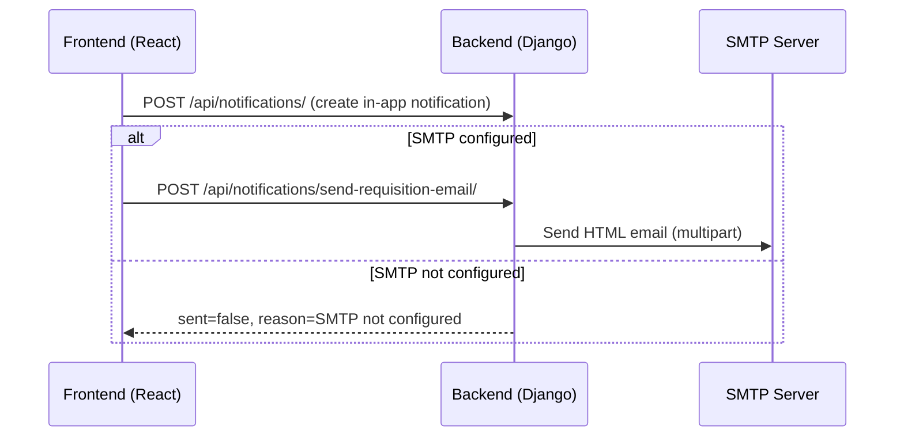
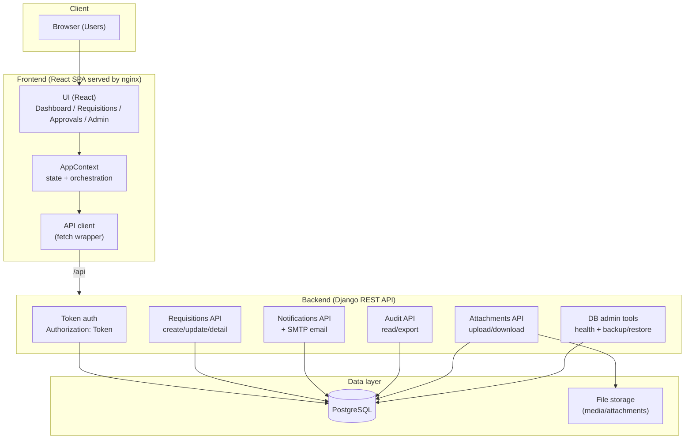
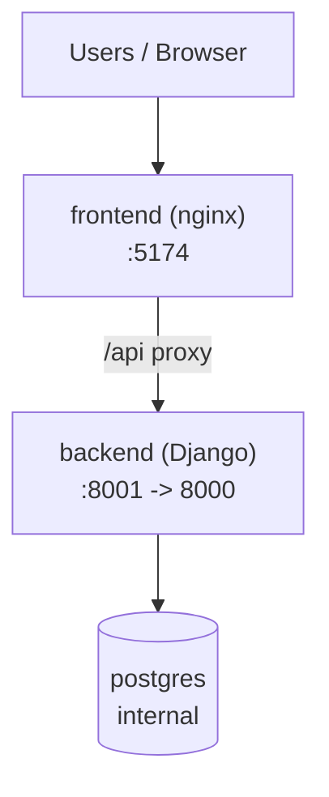
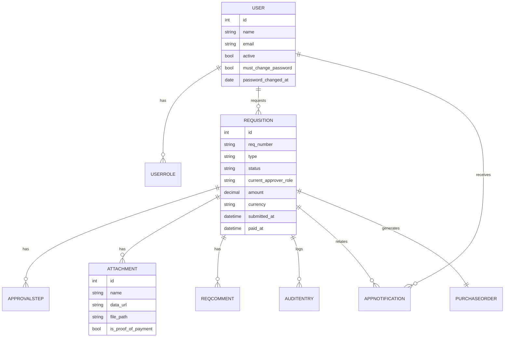

# MARS IRS (Internal Requisition System)

This repository contains the **MARS Internal Requisition System (IRS)**: a web app for raising internal requisitions (petty cash, supplier payments, high-value/CAPEX), routing them through an approval chain, tracking audit history, generating purchase orders (when applicable), and capturing proof-of-payment to complete the lifecycle.

It is designed for **internal business operations**: requesters submit requisitions; approvers review/approve/reject; finance processes payment; auditors review history; administrators manage users and platform configuration (SMTP, database backup/restore).

---

## Business requirements (what the system must do)

### Core capabilities

- **Raise requisitions** for:
  - **Petty Cash**
  - **Supplier Payment (Normal)**
  - **High-Value / CAPEX**
- **Capture request details** including purpose/justification, department, cost centre, currency, amount, and (for supplier flows) supplier details + line items.
- **Attach supporting documents** (invoices, quotations, tax clearance, VAT cert, proof-of-payment, etc.).
- **Submit for approval** and route through a **role-based approval chain**.
- **Enforce approval lifecycle** (Draft → Submitted → Pending Review/Approval → Pending Payment → Paid; with Rejected / Cancelled options).
- **Audit trail** of key actions (create, submit, approve, reject, payment, PO generation, account reset, etc.).
- **Notifications**:
  - In-app notifications to relevant users
  - Optional **email notifications** (when SMTP configured) with a formatted requisition summary.
- **Purchase Orders**:
  - Generate a PO when supplier/high-value requisitions reach the right stage (as configured in the current logic).
- **Administration**:
  - User CRUD, account reset (restore default password + force change on next login)
  - SMTP configuration
  - Database health checks + backups (create/list/download/restore; includes upload/restore of .sql)

### Non-functional requirements

- **Simple deployment** using Docker Compose (frontend + backend + Postgres).
- **Fast UI**: approvers can quickly review requisition details (including documents) before acting.
- **Data durability**: requisitions are stored in PostgreSQL; attachments can be stored as files on disk with download URLs.
- **Operational visibility**: database health and backup tools available (admin only).

---

## Roles & responsibilities

The system uses **users** with one or more **roles** (capabilities accumulate).

| Role | Primary responsibilities |
|------|--------------------------|
| Requester | Create draft, attach docs, submit for approval, view status, respond to rejection, cancel own requests (where allowed). |
| Department Manager | Approve/reject department-level requests; advance workflow. |
| Accountant | Review/approve steps; manage payment stage; upload proof-of-payment; may trigger transitions to “Pending Payment”. |
| General Manager / Financial Controller / Head of Operations | Approve later steps depending on requisition type and chain. |
| Auditor | Read-only oversight (audit trails, requisition history). |
| System Administrator | User management, SMTP settings, DB backups, account resets, platform admin tasks. |

---

## Requisition lifecycle (how work flows)

### State model (high-level)



### Approval chain (role-based)

Approval steps are persisted on each requisition as an ordered chain. The current code builds chains based on requisition type (templates live in the frontend and are persisted to backend on create/update).



### What approvers see before approving

Approvers should be able to view:
- Purpose (description + justification)
- Supplier details and line items (if applicable)
- Supporting documents
- Approval chain and who has acted
- Audit log entries

---

## Notifications & email (in-app + SMTP)

### In-app notifications

Notifications are created server-side as `AppNotification` records and displayed in the UI. The frontend creates notifications for:
- Request submission (to requester + first approver role)
- Each approval step (to requester + next approver role)
- Rejection (to requester)
- Payment completion (to requester)
- Miscellaneous events (e.g., PO generated)

### Email notifications (optional)

If SMTP is configured, the system sends notification emails. There are two kinds:

- **Simple email**: subject + plain body (generic)
- **Requisition HTML email**: subject + **HTML summary** laid out like a formal internal notification with a requisition summary table and line items

The requisition email format includes:
- A **headline** (e.g. “Your internal requisition has been approved.”)
- A **stage token** (e.g. `AwaitingGeneralManagerApproval`)
- A **Log in here** link (built using `FRONTEND_BASE_URL`)
- A summary table (Requisition #, purpose, requester, date, totals)
- Item list table (Description, Unit Price, Quantity, Amount)



### Email link configuration

Set these backend environment variables:

- `FRONTEND_BASE_URL` (**required for correct email login link**)  
  Example: `https://irs.yourcompany.com` (no trailing slash)
- `REQUISITION_EMAIL_SYSTEM_NAME` (optional)  
  Example: `MARS Internal Requisition System`

Docker Compose: set these in **`docker-compose.yml`** under the `backend` service `environment` block (`FRONTEND_BASE_URL`, `ALLOWED_HOSTS`, `CORS_ALLOWED_ORIGINS`, etc.).

---

## System architecture

### High-level overview



### Deployment topology (Docker Compose)



### Key data model (conceptual ERD)



---

## Folder & file layout (what lives where)

### Repo structure (important paths)

| Path | What it contains |
|------|------------------|
| `src/app/` | Frontend application code (React components, contexts, routes, API client). |
| `src/app/components/` | UI screens (Dashboard, RequisitionForm/Detail/List, UserManagement, SMTP settings, Audit trail, etc.). |
| `src/app/context/` | App state + workflows (submit, approve, reject, notify, upload POP). |
| `src/app/api/client.ts` | API wrapper + typed endpoints; token header handling. |
| `backend/` | Django project + app (`core`), migrations, settings. |
| `backend/core/views.py` | API endpoints: auth, users, requisitions, attachments, notifications, audit, SMTP settings. |
| `backend/core/models.py` | Data models (User, Requisition, ApprovalStep, Attachment, Notification, Audit, PO, etc.). |
| `backend/core/serializers.py` | DRF serializers + password hashing helpers. |
| `backend/core/requisition_email_html.py` | HTML email builder for formatted requisition notifications. |
| `nginx.conf` | Frontend nginx config + `/api/` proxy; includes `client_max_body_size` for large payloads. |
| `docker-compose.yml` | Local stack: Postgres + backend + frontend + pgAdmin. |
| `Dockerfile.frontend` | Builds SPA and serves it via nginx. |
| `docs/` | Deployment + architecture documentation (e.g. production checklist). |

### Frontend “workflow brain”

Most lifecycle actions are orchestrated from `src/app/context/AppContext.tsx`, including:
- Draft create/update
- Submit for approval
- Approve / reject
- Payment transitions + POP upload
- Notification fan-out (in-app + optional email)

### Backend responsibilities

The backend is the system of record for:
- Users & roles
- Requisitions, steps, comments, attachments, notifications, audit log
- SMTP send endpoints
- DB admin endpoints

---

## Deployment options (how to run it)

### Option A: Docker Compose (recommended)

**Prerequisites**: Docker + Docker Compose.

Run:

```bash
docker compose up --build -d
```

Services:
- Frontend: `http://localhost:5174`
- Backend API: `http://localhost:8001/api/`
- pgAdmin: `http://localhost:5050`

**Testing the API with Postman:** see **[docs/POSTMAN.md](docs/POSTMAN.md)** (authentication, all endpoints, examples, and Postman environment tips).

#### Configuring hosts, CORS, and email links (Docker)

Edit **`docker-compose.yml`** → `backend` → `environment`:

- `ALLOWED_HOSTS` — include your VM IP or public hostname (comma-separated).
- `CORS_ALLOWED_ORIGINS` — every browser origin that calls the API (e.g. `http://YOUR_IP:5174`).
- `FRONTEND_BASE_URL` — public app URL for email “log in” links (no trailing slash).
- `REQUISITION_EMAIL_SYSTEM_NAME` — label in notification emails.

Then:

```bash
docker compose up --build -d
```

### Option B: Local dev (no Docker)

You can run backend + frontend directly on your machine (requires PostgreSQL or `DATABASE_URL`).

Frontend:

```bash
npm install
npm run dev
```

Backend (example, adjust env):

```bash
cd backend
cp .env.example .env
# edit DB_* and CORS_ALLOWED_ORIGINS
python3 -m venv .venv && source .venv/bin/activate
pip install -r requirements.txt
python manage.py migrate
python manage.py runserver 0.0.0.0:8000
```

### Option C: Production deployment

Recommended production pattern:
- Run the stack behind HTTPS (reverse proxy / ingress).
- Set `DEBUG=False`, `SECRET_KEY`, `ALLOWED_HOSTS`, `CORS_ALLOWED_ORIGINS`.
- Configure SMTP using the admin UI (Email / SMTP settings).

See `docs/PRODUCTION.md` for a checklist.

---

## Configuration reference

### Frontend (build/runtime)

- `VITE_API_BASE` (build-time; in Dockerfile frontend build args)  
  - Empty string: frontend uses **same-origin `/api/`** (nginx proxy)  
  - Non-empty: points to backend URL (e.g. `http://localhost:8001`)

### Backend (environment)

Common:
- `DEBUG`
- `SECRET_KEY`
- `ALLOWED_HOSTS`
- `CORS_ALLOWED_ORIGINS`
- `DB_NAME`, `DB_USER`, `DB_PASSWORD`, `DB_HOST`, `DB_PORT` (or `DATABASE_URL`)

Email notifications:
- `FRONTEND_BASE_URL` (used for “Log in here” in emails)
- `REQUISITION_EMAIL_SYSTEM_NAME` (label shown above the summary table)

File storage:
- `MEDIA_ROOT` (where attachments are stored when uploaded as base64 data URLs)

---

## Operational notes & troubleshooting

### Attachments not visible to approvers

Supporting documents must be persisted as `Attachment` records on the requisition. The system supports:
- Supplier documents persisted server-side from `suppliers_json`
- General attachments persisted via `POST /api/requisitions/<id>/attachments/`

### Submit for approval fails on supplier flows

Large payloads (documents embedded as base64) can be rejected by nginx if body size is too small. The frontend nginx config sets:

- `client_max_body_size 20m;`

If you increase attachment size, adjust that value accordingly.

### SMTP configured but emails not received

Check:
- SMTP host/port/credentials in Email / SMTP settings
- Firewall rules and TLS requirements
- Backend logs for send errors
- `FRONTEND_BASE_URL` correctness (login link)

---

## Security notes (important)

The backend uses **token authentication** (`Authorization: Token <key>`). This repository is intended for **trusted internal environments**. If you plan to expose it publicly, you should harden:
- Authorization checks on sensitive endpoints (ensure actions are tied to authenticated user + role)
- Rate limiting and monitoring
- Secure secret management

See the “Important limitation: API authentication” section in `docs/PRODUCTION.md`.

---

## Ports

| Port  | Component        | When / where |
|-------|------------------|--------------|
| **5173** | Frontend (Vite dev server) | Local dev: `npm run dev`. |
| **5174** | Frontend (nginx) | Docker Compose: host port **5174** → container port 80. |
| **8000** | Backend (Django) | Inside backend container; also default `runserver` locally. |
| **8001** | Backend (Django) | Docker Compose: host port **8001** → container 8000. |
| **5050** | pgAdmin | Docker Compose: DB admin UI. |
| **5432** | PostgreSQL | Inside `db` container; not exposed by default. |

---

## Quick start (copy/paste)

```bash
# 1) Run the stack
docker compose up --build -d

# 2) Open the app
open http://localhost:5174

# 3) (Optional) edit docker-compose.yml backend env for your IP/domain, then:
docker compose up --build -d
```
