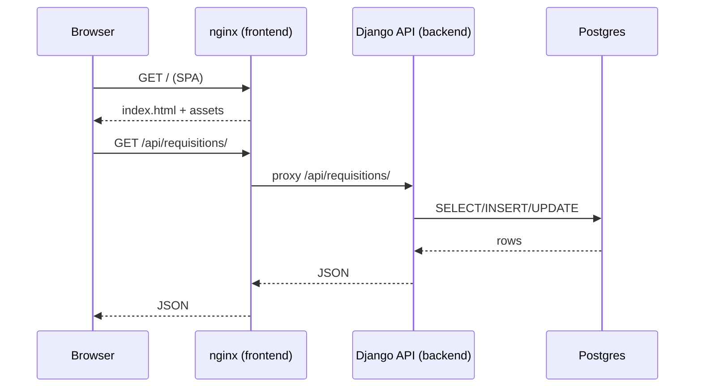
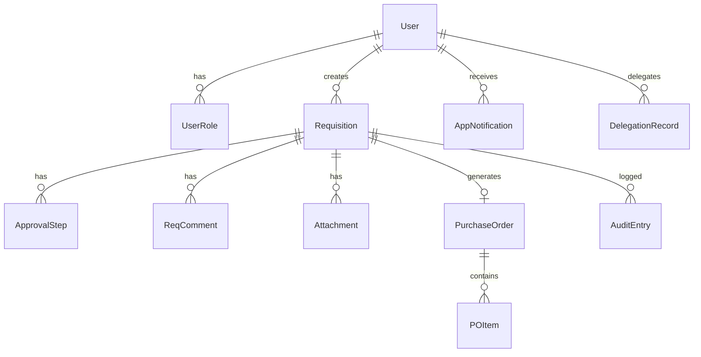
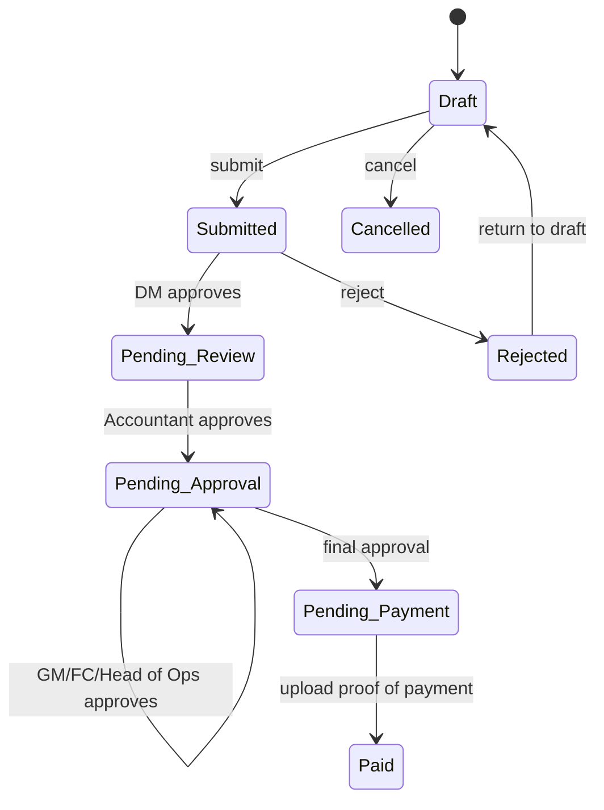
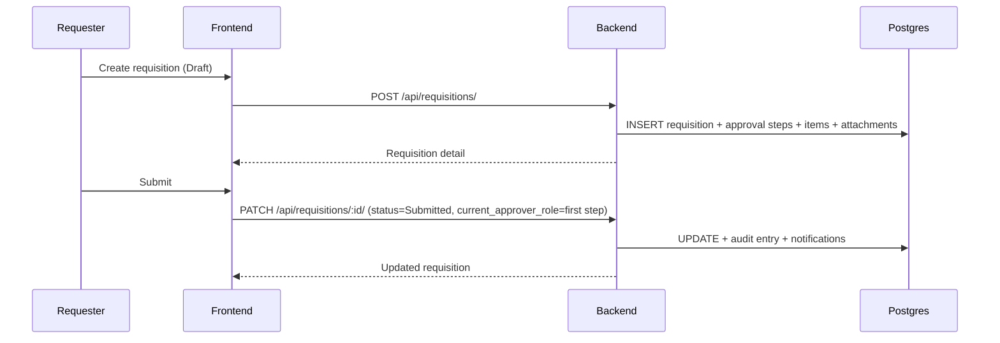
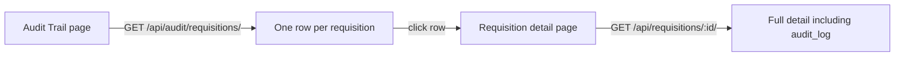

# IR System – Full Architecture (Docker Production)

This document describes the IR (Internal Requisitions) system end-to-end: business requirements, architecture, tech stack, database model, folder structure, routing of requests, key user workflows, Docker deployment, maintenance/scaling, and security.

---

## Business requirements (what the system must do)

- **Requisitions**
  - Create requisitions (Draft → Submit).
  - Support multiple requisition types: Petty Cash, Supplier Payment (Normal), High-Value/CAPEX.
  - Capture supplier details, bank details, and type-specific fields (travel/fuel, assets, maintenance).
  - Attach supporting documents (quotations, receipts, authorisations, etc.).
- **Approvals**
  - Multi-step approval chain by role (Department Manager → Accountant → GM/FC/etc.).
  - Approver can approve/reject; comments recorded.
  - Delegation of approval responsibilities.
- **Payment**
  - After final approval, requisition moves to Pending Payment.
  - Accountant uploads proof of payment and closes the loop (Paid).
- **Purchase Orders**
  - Generate PO for applicable requisitions.
  - PO has line items and can be downloaded as PDF.
- **Auditability**
  - Immutable audit trail of actions (“who did what and when”).
  - Auditors can see a requisition-level audit summary and drill into the full requisition.
- **Notifications**
  - In-app notifications for submission/approvals/status updates.
  - Optional email notifications via SMTP settings (admin-configured).
- **Administration**
  - User management (create/update/activate/deactivate, roles).
  - Database health and backup/restore utilities.

---

## System context (high level)

```mermaid
flowchart TB
  U[Users<br/>Requester / Approver / Accountant / Auditor / Admin]
  FE[Frontend<br/>React SPA served by nginx]
  BE[Backend API<br/>Django + DRF (Gunicorn)]
  DB[(PostgreSQL)]
  VOL[(Docker volumes<br/>postgres_data, pg_backups)]

  U -->|HTTP/HTTPS| FE
  FE -->|/api (same-origin) or VITE_API_BASE| BE
  BE -->|SQL| DB
  DB --> VOL
  BE --> VOL
```

---

## Tech stack & technologies used

### Frontend

- **React 18** + **React Router 7** (`src/app/routes.tsx`)
- **Vite 6** build tool
- **Tailwind CSS 4** styling
- UI primitives/components from **Radix UI**, plus app-specific components in `src/app/components/`
- **jsPDF** + **jspdf-autotable** for PDF generation (Audit export, PO download)

### Backend

- **Python 3.12** (Docker base image)
- **Django 5** + **Django REST Framework**
- **gunicorn** WSGI server (see `backend/Dockerfile`)
- **psycopg3** PostgreSQL driver (`psycopg[binary]`)
- **django-cors-headers** for CORS
- **bcrypt** for password hashing
- Uses `pg_dump` / `psql` for backups and restore (see `backend/core/db_admin.py`)

### Database

- **PostgreSQL 16** (Docker image `postgres:16-alpine`)
- Persistent storage in Docker named volume: **`postgres_data`**
- Backups stored in Docker named volume: **`pg_backups`** (mounted at `/backups` in backend)

---

## Repository structure (folder map)

```text
IR/
  docker-compose.yml            # local/prod compose base (dev defaults, adjust envs for prod)
  Dockerfile.frontend           # builds SPA and serves via nginx
  nginx.conf                    # nginx config (static + /api proxy)
  package.json                  # frontend deps + scripts (vite)
  src/
    app/
      api/client.ts             # API client, VITE_API_BASE + /api paths
      components/               # UI screens + shared components
      context/                  # AppContext/AuthContext state
      data/                     # types + role capabilities
      routes.tsx                # frontend routing + role guards
      utils/                    # exports, helpers
  backend/
    Dockerfile                  # Django + Gunicorn container
    entrypoint.sh               # waits for DB, migrates, seeds admin
    requirements.txt            # backend deps
    manage.py
    config/                     # django settings/urls/wsgi/asgi
    core/
      models.py                 # DB schema
      serializers.py            # DRF serializers + password hash/check
      views.py                  # main API
      urls.py                   # API routes
      db_admin.py               # DB health, backups, restore
      smtp_config.py            # SMTP settings persistence
      management/commands/      # seed command(s)
      migrations/               # DB migrations
  docs/
    ARCHITECTURE.md             # older/high-level overview
    PRODUCTION.md               # production checklist (docker)
    database.mmd                # ERD diagram (mermaid)
```

---

## Request routing (from browser to DB)

### Container-level routing

- Browser calls the **frontend** at `http://<host>:5174`.
- nginx serves static assets and proxies API calls to the backend:
  - `GET/POST/… /api/*` → backend container `backend:8000`
- Frontend API base:
  - If **`VITE_API_BASE=""`**: frontend calls **same-origin** `/api/...` (nginx proxy).
  - If set: frontend calls `VITE_API_BASE + "/api/..."`.



---

## Frontend routes (user-facing pages)

Defined in `src/app/routes.tsx`.

### Main

- `/dashboard`
- `/my-requisitions`
- `/pending-approvals`
- `/department-requisitions`
- `/all-requisitions`
- `/requisitions/new`
- `/requisitions/:id`
- `/requisitions/:id/edit`
- `/purchase-orders`
- `/reports`
- `/audit-trail` (Auditor + Financial Controller)
- `/notifications`

### Admin

- `/admin/users`
- `/admin/database`
- `/admin/email-settings`

Role access is enforced in the UI via `RequireRole` (multi-role aware).

---

## Backend API routes

Defined in `backend/core/urls.py` under the `/api/` prefix (via Django project URL config).

### Auth

- `POST /api/auth/login/`

### Users

- `GET/POST /api/users/`
- `GET/PATCH/DELETE /api/users/:id/`

### Requisitions

- `GET/POST /api/requisitions/`
- `GET/PATCH/DELETE /api/requisitions/:id/`
- `POST /api/requisitions/:id/comments/`
- `POST /api/requisitions/:id/attachments/`
- `POST /api/requisitions/:id/generate-po/`

### Purchase Orders

- `GET /api/purchase-orders/`
- `PATCH /api/purchase-orders/:id/`

### Notifications

- `GET/POST /api/notifications/`
- `PATCH /api/notifications/:id/read/`
- `POST /api/notifications/mark-all-read/`
- `POST /api/notifications/send-email/` (SMTP-enabled)

### Delegations

- `GET/POST /api/delegations/`
- `GET/PATCH/DELETE /api/delegations/:id/`

### Audit

- `GET /api/audit/` (entry-level)
- `GET /api/audit/requisitions/` (one row per requisition summary; drill-down via requisition detail)
- `GET /api/audit/export/` (CSV)

### Database admin

- `GET /api/database/health/`
- `GET /api/database/backups/`
- `POST /api/database/backups/create/`
- `POST /api/database/backups/restore/`

### SMTP settings (admin)

- `GET /api/settings/smtp/`
- `POST /api/settings/smtp/save/`

---

## Database model (ERD)

The DB schema is implemented in `backend/core/models.py`. The ERD is in `docs/database.mmd`.



### What is stored in DB

- Users, roles, requisitions, approval chain, comments, attachments, PO + items, notifications, delegations, audit entries.
- Attachments currently store `data_url` (commonly base64 or URL) in DB (see `Attachment.data_url`).

---

## Key workflows (flows & diagrams)

### Requisition lifecycle



### Submit → approval chain → notifications



### Auditor drill-down (summary → full activity)



---

## Docker deployment (instructions)

### Prerequisites

- Docker Engine + Docker Compose plugin installed.
- Ports available: **5174** (frontend), **8001** (backend). Postgres is internal.

### Run the stack

```bash
cd /path/to/IR
docker compose build
docker compose up -d
docker compose ps
```

Open:

- Frontend: `http://localhost:5174`
- Backend API: `http://localhost:8001/api/…`

### Persistence

- DB data: `postgres_data` volume.
- Backups: `pg_backups` volume (mounted at `/backups` in backend).

### Container resiliency (auto-restart)

`docker-compose.yml` uses `restart: unless-stopped` for:

- `db`
- `backend`
- `frontend`

So containers restart automatically after crashes and after host reboot once Docker starts.

### Migrations & seeding

On backend container start (see `backend/entrypoint.sh`):

- waits for DB to be ready
- runs `python manage.py migrate --noinput`
- seeds initial admin user (only if no users exist)

Seed admin credentials are configurable via env:

- `ADMIN_EMAIL` (default `admin@marsambulance.com`)
- `ADMIN_PASSWORD` (default `mars2026`) — set a strong password in production

---

## Maintenance & operations

### Backups / restores

- List backups: `GET /api/database/backups/`
- Create backup: `POST /api/database/backups/create/`
- Restore backup: `POST /api/database/backups/restore/`

Notes:

- Backups are created with `pg_dump --clean --if-exists` so restores can safely replace existing objects.
- Restore filters out `transaction_timeout` settings to remain compatible when dumps come from newer PostgreSQL versions.

### Observability

- Use `docker compose logs -f backend` / `frontend` / `db`.
- DB health endpoint: `GET /api/database/health/`

### Upgrades

- Apply code changes → rebuild images → `docker compose up -d`.
- Database schema changes are applied via Django migrations on startup (unless `SKIP_MIGRATE` is set).

---

## Scaling strategy (when usage grows)

### Frontend

- Stateless static assets: scale horizontally easily (multiple nginx instances behind a load balancer).

### Backend

- Stateless API processes: run multiple replicas behind a load balancer.
- Increase Gunicorn workers/threads depending on CPU and IO.
- Externalize settings via environment variables; keep containers immutable.

### Database

- Scale vertically first (CPU/RAM/IOPS).
- Add read replicas if reporting/audit queries become heavy.
- Maintain backup retention and test restore.

---

## Security (current posture + recommendations)

### Environment & Django security

- Use a strong `SECRET_KEY` and `DEBUG=False` in production.
- When `DEBUG=False`, the backend enables secure cookie flags and respects HTTPS proxy headers (see `backend/config/settings.py`).

### CORS and network exposure

- Set `ALLOWED_HOSTS` to exact hostnames.
- Set `CORS_ALLOWED_ORIGINS` to exact frontend origin(s).
- Put backend behind HTTPS (reverse proxy) in production.

### Critical limitation: API authentication

The backend endpoints are currently permissive (`AllowAny`) and do not enforce server-side authentication/authorization.

- Suitable for **trusted networks** (internal deployments) or when the API is protected by an upstream gateway/SSO.
- Not sufficient for a fully public internet deployment.

**To harden**:

- Introduce server-side auth (sessions/JWT) and require authentication for all endpoints.
- Enforce authorization checks based on the authenticated user and role (do not trust `user_id` fields sent by the client).
- Add CSRF protection strategy if using cookie-based auth.

### Data & attachments

- Attachments currently store `data_url` in DB. For large files and production-grade storage:
  - Store files in object storage (S3-compatible) and keep only metadata + URL in DB.
  - Add file size/type validation.

---

## Appendix: Ports

- **5174**: frontend (nginx)
- **8001**: backend (host) → **8000** in container
- **5432**: Postgres internal (container)

