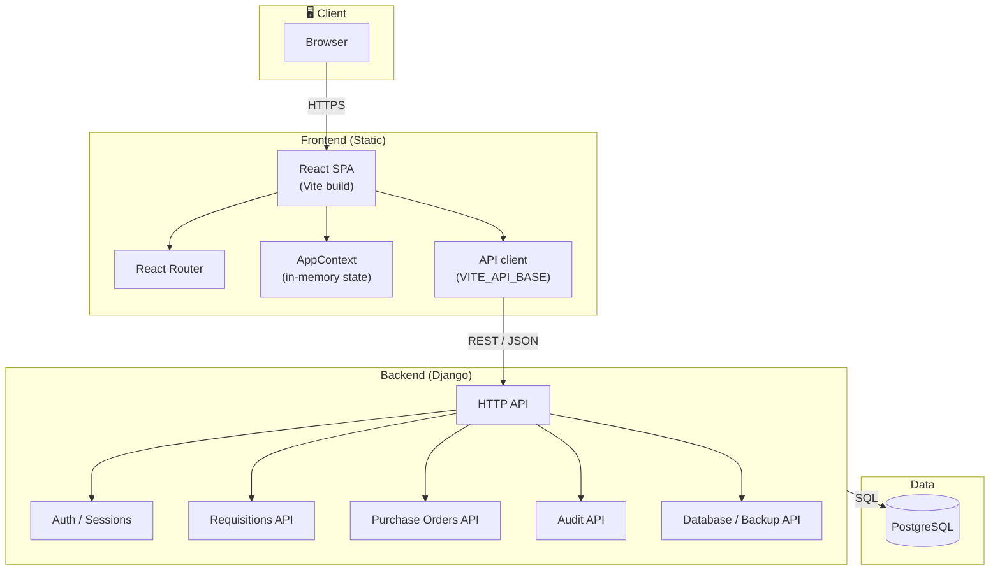
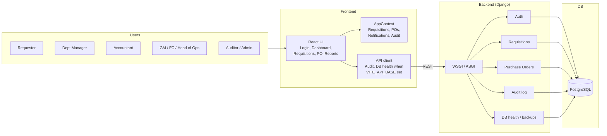
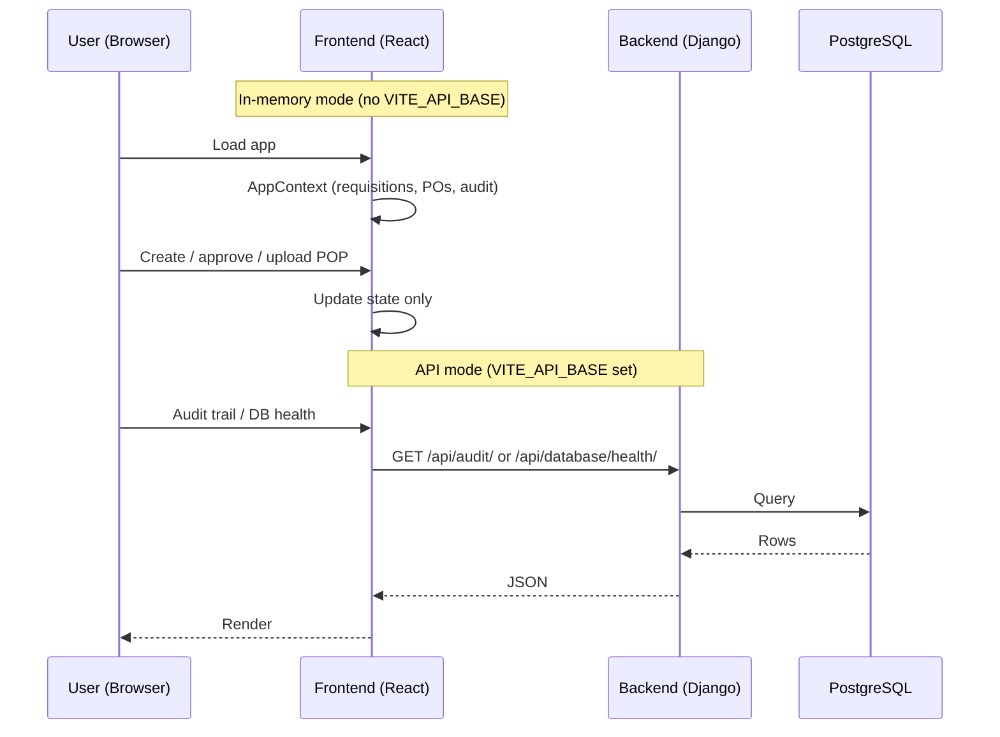
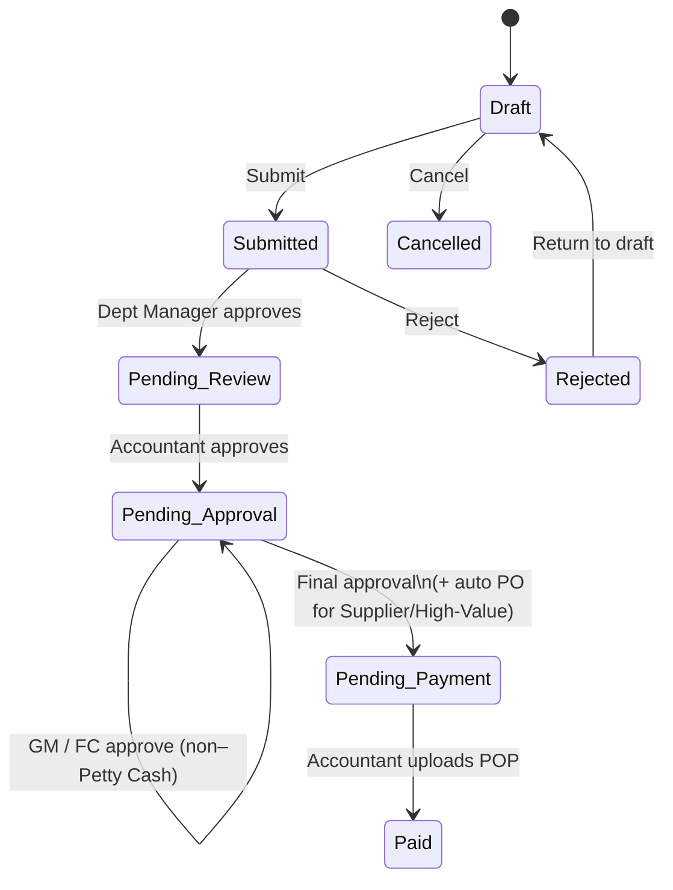
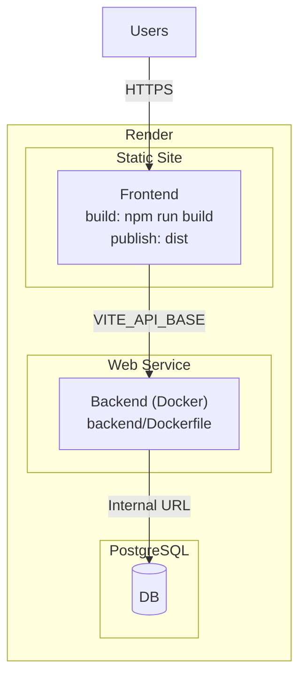

# MARS IRS – System Architecture

High-level architecture of the full system (frontend, backend, database) and main data flows.

---

## High-level overview

---

## Component diagram

---

## Request flow (simplified)

---

## Requisition lifecycle (logical flow)

---

## Deployment (e.g. Render)

---

## Ports used by the system

| Port  | Component        | When / where |
|-------|------------------|--------------|
| **5173** | Frontend (Vite dev server) | Local dev: `npm run dev`. Default Vite port; may show 5174, 5175 if 5173 is in use. |
| **5174** | Frontend (nginx) | Docker Compose: host port **5174** → container port 80. Access app at `http://localhost:5174`. |
| **8000** | Backend (Django) | Inside backend container; also Django default when running `runserver` locally. |
| **8001** | Backend (Django) | Docker Compose: host port **8001** → container 8000. Frontend (when built with `VITE_API_BASE=http://localhost:8001`) calls API at `http://localhost:8001`. |
| **5432** | PostgreSQL       | DB listens on **5432** inside the `db` container. Not exposed to host in `docker-compose.yml`; only the backend container connects to it. If you run Postgres locally, it uses 5432 on the host. |

**Summary**

- **Docker Compose:** Use **5174** (frontend) and **8001** (backend) on your machine; Postgres is internal (5432).
- **Local dev (no Docker):** Frontend **5173**, backend **8000**, Postgres **5432** (if running locally).

---

## File / repo layout (conceptual)

| Layer      | Location        | Purpose |
|-----------|------------------|--------|
| Frontend  | `/` (repo root)  | Vite, React, Tailwind; `src/app/` (components, context, routes). |
| Backend   | `/backend`       | Django app; `manage.py`, Dockerfile, entrypoint, migrations. |
| Docs      | `/docs`          | Architecture, deploy guides. |
| Docker    | `docker-compose.yml`, `Dockerfile.frontend` | Local run: db + backend + frontend. |

---

## Summary

- **Frontend:** Single-page app (React + Vite). Serves static assets; state in memory (AppContext) or via backend when `VITE_API_BASE` is set (audit, DB health).
- **Backend:** Django HTTP API for auth, requisitions, POs, audit, DB health/backups. Writes to PostgreSQL.
- **Database:** PostgreSQL; holds users, requisitions, approval chains, POs, audit log, attachments/POP metadata (and optionally file storage).
- **Deployment:** Frontend as static site; backend as web service (e.g. Docker on Render); PostgreSQL as managed DB. Frontend build-time env `VITE_API_BASE` points to backend URL.
